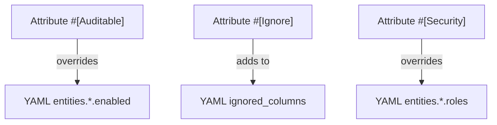

# Entity Attributes

> **Configure auditing with PHP 8 attributes**

PHP attributes provide an alternative to YAML configuration for declaring auditable entities.

> [!NOTE]
> Attributes take precedence over YAML configuration.

## 📋 Available Attributes

| Attribute      | Target   | Description                           |
|----------------|----------|---------------------------------------|
| `#[Auditable]` | Class    | Marks an entity as auditable          |
| `#[Ignore]`    | Property | Excludes a property from auditing     |
| `#[Security]`  | Class    | Defines roles required to view audits |    

All attributes are in the `DH\Auditor\Provider\Doctrine\Auditing\Attribute` namespace.

## 🏷️ #[Auditable]

Marks an entity class for auditing.

### Basic Usage

```php
<?php

namespace App\Entity;

use DH\Auditor\Provider\Doctrine\Auditing\Attribute as Audit;
use Doctrine\ORM\Mapping as ORM;

#[ORM\Entity]
#[Audit\Auditable]
class User
{
    #[ORM\Id]
    #[ORM\GeneratedValue]
    #[ORM\Column]
    private ?int $id = null;

    #[ORM\Column(length: 180)]
    private ?string $email = null;
    
    // ...
}
```

### Disabled by Default

Create an audit table but don't log until enabled at runtime:

```php
#[ORM\Entity]
#[Audit\Auditable(enabled: false)]
class User
{
    // Auditing is OFF by default
    // Can be enabled at runtime
}
```

## 🚫 #[Ignore]

Excludes a property from being audited.

```php
<?php

namespace App\Entity;

use DH\Auditor\Provider\Doctrine\Auditing\Attribute as Audit;
use Doctrine\ORM\Mapping as ORM;

#[ORM\Entity]
#[Audit\Auditable]
class User
{
    #[ORM\Column]
    private ?string $email = null;

    #[ORM\Column]
    #[Audit\Ignore]
    private ?string $password = null;  // Not audited

    #[ORM\Column]
    #[Audit\Ignore]
    private ?\DateTimeImmutable $lastLoginAt = null;  // Not audited
}
```

> [!TIP]
> Properties in the global `ignored_columns` configuration don't need `#[Ignore]`.

## 🔒 #[Security]

Restricts access to view audit logs based on user roles.

```php
<?php

namespace App\Entity;

use DH\Auditor\Provider\Doctrine\Auditing\Attribute as Audit;
use Doctrine\ORM\Mapping as ORM;

#[ORM\Entity]
#[Audit\Auditable]
#[Audit\Security(view: ['ROLE_ADMIN'])]
class User
{
    // Only users with ROLE_ADMIN can view User audits
}
```

### Multiple Roles (OR Logic)

```php
#[Audit\Security(view: ['ROLE_ADMIN', 'ROLE_AUDITOR'])]
class User
{
    // Users with ROLE_ADMIN OR ROLE_AUDITOR can view
}
```

## 📝 Complete Example

```php
<?php

namespace App\Entity;

use DH\Auditor\Provider\Doctrine\Auditing\Attribute as Audit;
use Doctrine\ORM\Mapping as ORM;

#[ORM\Entity]
#[Audit\Auditable]
#[Audit\Security(view: ['ROLE_ADMIN', 'ROLE_AUDITOR'])]
class User
{
    #[ORM\Id]
    #[ORM\GeneratedValue]
    #[ORM\Column]
    private ?int $id = null;

    #[ORM\Column(length: 180, unique: true)]
    private ?string $email = null;

    #[ORM\Column]
    #[Audit\Ignore]
    private ?string $password = null;

    #[ORM\Column(length: 255)]
    private ?string $firstName = null;

    #[ORM\Column(length: 255)]
    private ?string $lastName = null;

    #[ORM\Column]
    #[Audit\Ignore]
    private ?\DateTimeImmutable $lastLoginAt = null;

    // Getters and setters...
}
```

## 🔀 Combining with YAML

You can use both attributes and YAML configuration:

```yaml
# config/packages/dh_auditor.yaml
dh_auditor:
    providers:
        doctrine:
            ignored_columns:
                - createdAt
                - updatedAt
            entities:
                App\Entity\User: ~   # Declares entity is auditable
                App\Entity\Post: ~
```

```php
// Entity uses attributes for fine-grained control
#[ORM\Entity]
#[Audit\Auditable]
#[Audit\Security(view: ['ROLE_ADMIN'])]
class User
{
    #[Audit\Ignore]
    private ?string $password = null;
    
    // createdAt and updatedAt are automatically ignored via YAML
}
```

### 📊 Precedence Rules



| Attribute       | Behavior                                    |
|-----------------|---------------------------------------------|
| `#[Auditable]`  | Overrides `entities.*.enabled` from YAML    |
| `#[Ignore]`     | Adds to `ignored_columns` (YAML + attribute)|
| `#[Security]`   | Overrides `entities.*.roles` from YAML      |

## ⚠️ Entity Not in YAML

> [!CAUTION]
> If an entity has `#[Auditable]` but isn't in YAML `entities`, it will **not** be audited.

```yaml
# User is NOT listed here
dh_auditor:
    providers:
        doctrine:
            entities:
                App\Entity\Post: ~
```

```php
// This entity will NOT be audited (not in YAML)
#[Audit\Auditable]
class User {}
```

Either:
- ✅ Add to YAML: `App\Entity\User: ~`
- ✅ Or use YAML-only configuration

---

## 🚀 Next Steps

- ⚙️ [Configuration Reference](index.md) - All YAML options
- 🗄️ [Storage Configuration](storage.md) - Multi-database setup
- 🛡️ [Role Checker](../customization/role-checker.md) - Custom access control
