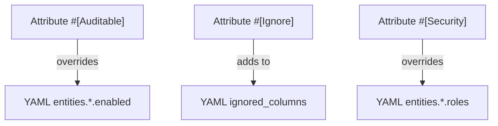

# Entity Attributes

> **Configure auditing with PHP 8 attributes**

PHP attributes provide an alternative to YAML configuration for declaring auditable entities.

> [!NOTE]
> Attributes take precedence over YAML configuration.

## 📋 Available Attributes

| Attribute        | Target   | Description                                      |
|------------------|----------|--------------------------------------------------|
| `#[Auditable]`   | Class    | Marks an entity as auditable                     |
| `#[Ignore]`      | Property | Excludes a property from auditing                |
| `#[Security]`    | Class    | Defines roles required to view audits            |
| `#[DiffLabel]`   | Property | Attaches a human-readable label resolver to a field |

All attributes are in the `DH\Auditor\Attribute` namespace (auditor core).

## 🏷️ #[Auditable]

Marks an entity class for auditing.

### Basic Usage

```php
<?php

namespace App\Entity;

use DH\Auditor\Attribute\Auditable;
use Doctrine\ORM\Mapping as ORM;

#[ORM\Entity]
#[Auditable]
class User
{
    #[ORM\Id]
    #[ORM\GeneratedValue]
    #[ORM\Column]
    private ?int $id = null;

    #[ORM\Column(length: 180)]
    private ?string $email = null;
    
    // ...
}
```

### Disabled by Default

Create an audit table but don't log until enabled at runtime:

```php
#[ORM\Entity]
#[Auditable(enabled: false)]
class User
{
    // Auditing is OFF by default
    // Can be enabled at runtime
}
```

## 🚫 #[Ignore]

Excludes a property from being audited.

```php
<?php

namespace App\Entity;

use DH\Auditor\Attribute\Auditable;
use DH\Auditor\Attribute\Ignore;
use Doctrine\ORM\Mapping as ORM;

#[ORM\Entity]
#[Auditable]
class User
{
    #[ORM\Column]
    private ?string $email = null;

    #[ORM\Column]
    #[Ignore]
    private ?string $password = null;  // Not audited

    #[ORM\Column]
    #[Ignore]
    private ?\DateTimeImmutable $lastLoginAt = null;  // Not audited
}
```

> [!TIP]
> Properties in the global `ignored_columns` configuration don't need `#[Ignore]`.

## 🔒 #[Security]

Restricts access to view audit logs based on user roles.

```php
<?php

namespace App\Entity;

use DH\Auditor\Attribute\Auditable;
use DH\Auditor\Attribute\Security;
use Doctrine\ORM\Mapping as ORM;

#[ORM\Entity]
#[Auditable]
#[Security(view: ['ROLE_ADMIN'])]
class User
{
    // Only users with ROLE_ADMIN can view User audits
}
```

### Multiple Roles (OR Logic)

```php
#[Security(view: ['ROLE_ADMIN', 'ROLE_AUDITOR'])]
class User
{
    // Users with ROLE_ADMIN OR ROLE_AUDITOR can view
}
```

## 📝 Complete Example

```php
<?php

namespace App\Entity;

use DH\Auditor\Attribute\Auditable;
use DH\Auditor\Attribute\Ignore;
use DH\Auditor\Attribute\Security;
use Doctrine\ORM\Mapping as ORM;

#[ORM\Entity]
#[Auditable]
#[Security(view: ['ROLE_ADMIN', 'ROLE_AUDITOR'])]
class User
{
    #[ORM\Id]
    #[ORM\GeneratedValue]
    #[ORM\Column]
    private ?int $id = null;

    #[ORM\Column(length: 180, unique: true)]
    private ?string $email = null;

    #[ORM\Column]
    #[Ignore]
    private ?string $password = null;

    #[ORM\Column(length: 255)]
    private ?string $firstName = null;

    #[ORM\Column(length: 255)]
    private ?string $lastName = null;

    #[ORM\Column]
    #[Ignore]
    private ?\DateTimeImmutable $lastLoginAt = null;

    // Getters and setters...
}
```

## 🔀 Combining with YAML

You can use both attributes and YAML configuration:

```yaml
# config/packages/dh_auditor.yaml
dh_auditor:
    providers:
        doctrine:
            ignored_columns:
                - createdAt
                - updatedAt
            entities:
                App\Entity\User: ~   # Declares entity is auditable
                App\Entity\Post: ~
```

```php
// Entity uses attributes for fine-grained control
#[ORM\Entity]
#[Auditable]
#[Security(view: ['ROLE_ADMIN'])]
class User
{
    #[Ignore]
    private ?string $password = null;
    
    // createdAt and updatedAt are automatically ignored via YAML
}
```

### 📊 Precedence Rules


```mermaid
flowchart TD
    A["Attribute #[Auditable]"] -->|overrides| B["YAML entities.*.enabled"]
    C["Attribute #[Ignore]"] -->|adds to| D["YAML ignored_columns"]
    E["Attribute #[Security]"] -->|overrides| F["YAML entities.*.roles"]
```

| Attribute       | Behavior                                    |
|-----------------|---------------------------------------------|
| `#[Auditable]`  | Overrides `entities.*.enabled` from YAML    |
| `#[Ignore]`     | Adds to `ignored_columns` (YAML + attribute)|
| `#[Security]`   | Overrides `entities.*.roles` from YAML      |

## ⚠️ Entity Not in YAML

> [!CAUTION]
> If an entity has `#[Auditable]` but isn't in YAML `entities`, it will **not** be audited.

```yaml
# User is NOT listed here
dh_auditor:
    providers:
        doctrine:
            entities:
                App\Entity\Post: ~
```

```php
// This entity will NOT be audited (not in YAML)
#[Auditable]
class User {}
```

Either:
- ✅ Add to YAML: `App\Entity\User: ~`
- ✅ Or use YAML-only configuration

---

## 🏷️ #[DiffLabel]

Attaches a **human-readable label resolver** to a scalar property so that audit diffs store `{"value": 1, "label": "Electronics"}` instead of just `1`.

```php
<?php

namespace App\Entity;

use App\Audit\Resolver\CategoryResolver;
use DH\Auditor\Attribute\Auditable;
use DH\Auditor\Attribute\DiffLabel;
use Doctrine\DBAL\Types\Types;
use Doctrine\ORM\Mapping as ORM;

#[ORM\Entity]
#[Auditable]
class Product
{
    #[ORM\Column(type: Types::INTEGER)]
    #[DiffLabel(resolver: CategoryResolver::class)]
    private int $categoryId;
}
```

The `resolver` argument must be the fully-qualified class name of a class implementing `DiffLabelResolverInterface`:

```php
use DH\Auditor\Contract\DiffLabelResolverInterface;

final class CategoryResolver implements DiffLabelResolverInterface
{
    public function __invoke(mixed $value): ?string
    {
        // return a label string, or null to store the plain value
        return match($value) {
            1 => 'Books',
            2 => 'Electronics',
            default => null,
        };
    }
}
```

> [!TIP]
> See the [Diff Label Resolvers guide](../customization/diff-label-resolvers.md) for the full reference, including constraints on resolver behaviour and viewer integration.

---

## 🚀 Next Steps

- ⚙️ [Configuration Reference](index.md) - All YAML options
- 🗄️ [Storage Configuration](storage.md) - Multi-database setup
- 🛡️ [Role Checker](../customization/role-checker.md) - Custom access control
- 🏷️ [Diff Label Resolvers](../customization/diff-label-resolvers.md) - Human-readable labels in diffs
