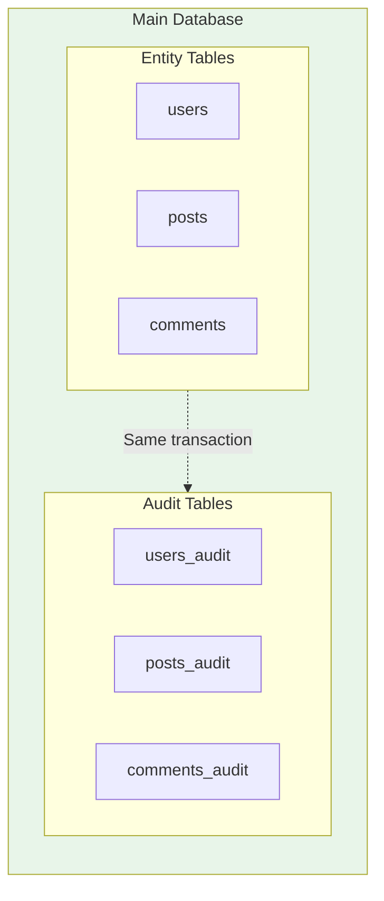
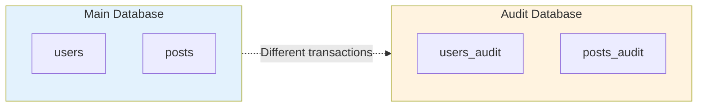

# Storage Configuration

> **Configure audit storage, including multi-database setups**

This guide covers audit storage configuration, including multi-database setups.

## 🗄️ Default Setup

By default, audits are stored in the same database as your entities using the default entity manager:

```yaml
dh_auditor:
    providers:
        doctrine:
            storage_services:
                - '@doctrine.orm.default_entity_manager'
```

This provides **transactional integrity**: audit entries are part of the same database transaction as entity changes.

## 📝 Table Naming

Audit tables are named: `{prefix}{entity_table}{suffix}`

| Option         | Default    | Example (entity: `users`) |
|----------------|------------|---------------------------|
| `table_prefix` | `''`       | → `users_audit`           |
| `table_suffix` | `'_audit'` | → `users_audit`           |            

```yaml
dh_auditor:
    providers:
        doctrine:
            table_prefix: 'audit_'
            table_suffix: ''
```

Result: `users` → `audit_users`

## 🗃️ Multi-Database Setup

Store audits in a separate database from your entities.

> [!CAUTION]
> **Warning: Atomicity**
> 
> Using separate databases **breaks transactional integrity**:
> - Entity changes and audits are in **different transactions**
> - If entity operation succeeds but audit fails → missing audit
> - If entity operation fails but audit succeeds → orphan audit
> 
> Only use this when the trade-offs are acceptable.

### Configuration

#### 1️⃣ Configure Multiple Entity Managers

```yaml
# config/packages/doctrine.yaml
doctrine:
    dbal:
        default_connection: default
        connections:
            default:
                url: '%env(DATABASE_URL)%'
            audit:
                url: '%env(AUDIT_DATABASE_URL)%'
    
    orm:
        default_entity_manager: default
        entity_managers:
            default:
                connection: default
                mappings:
                    App:
                        type: attribute
                        dir: '%kernel.project_dir%/src/Entity'
                        prefix: 'App\Entity'
            audit:
                connection: audit
                # No mappings needed - audit tables are created dynamically
```

#### 2️⃣ Configure Storage Services

```yaml
# config/packages/dh_auditor.yaml
dh_auditor:
    providers:
        doctrine:
            storage_services:
                - '@doctrine.orm.audit_entity_manager'
            
            auditing_services:
                - '@doctrine.orm.default_entity_manager'
            
            entities:
                App\Entity\User: ~
```

### 🗺️ Storage Mapper

When using multiple storage services, a storage mapper routes audits to the correct database.

#### Creating a Storage Mapper

```php
<?php

namespace App\Audit;

use DH\Auditor\Provider\Service\StorageServiceInterface;

class StorageMapper
{
    /**
     * @param string $entity The audited entity FQCN
     * @param array<string, StorageServiceInterface> $storageServices
     */
    public function __invoke(string $entity, array $storageServices): StorageServiceInterface
    {
        // All audits go to the audit database
        return $storageServices['dh_auditor.provider.doctrine.storage_services.doctrine.orm.audit_entity_manager'];
    }
}
```

#### Routing by Entity

```php
<?php

namespace App\Audit;

use App\Entity\HighSecurityEntity;
use App\Entity\SensitiveData;
use DH\Auditor\Provider\Service\StorageServiceInterface;

class StorageMapper
{
    private const SECURE_ENTITIES = [
        HighSecurityEntity::class,
        SensitiveData::class,
    ];

    public function __invoke(string $entity, array $storageServices): StorageServiceInterface
    {
        if (in_array($entity, self::SECURE_ENTITIES, true)) {
            return $storageServices['dh_auditor.provider.doctrine.storage_services.doctrine.orm.secure_entity_manager'];
        }

        return $storageServices['dh_auditor.provider.doctrine.storage_services.doctrine.orm.default_entity_manager'];
    }
}
```

#### Configuration

```yaml
# config/packages/dh_auditor.yaml
dh_auditor:
    providers:
        doctrine:
            storage_services:
                - '@doctrine.orm.default_entity_manager'
                - '@doctrine.orm.secure_entity_manager'
            
            storage_mapper: 'App\Audit\StorageMapper'
```

## 🔧 Schema Management

### Single Database

Use standard Doctrine tools:

```bash
# With migrations (recommended)
bin/console doctrine:migrations:diff
bin/console doctrine:migrations:migrate

# Or schema tool
bin/console doctrine:schema:update --force
```

### Multiple Databases

Use the audit schema command:

```bash
# Preview changes
bin/console audit:schema:update --dump-sql

# Apply changes
bin/console audit:schema:update --force
```

This command handles all configured storage services.

## 🏗️ Architecture Comparison

### Single Database (Recommended)



✅ **Same transaction = Data integrity**

### Separate Database



⚠️ **Different transactions = Possible inconsistency**

---

## 🚀 Next Steps

- ⚙️ [Configuration Reference](index.md) - All options
- ⬆️ [Upgrade Guide](../upgrade/index.md) - Managing audit tables
- 🔧 [Customization](../customization/index.md) - Custom providers
