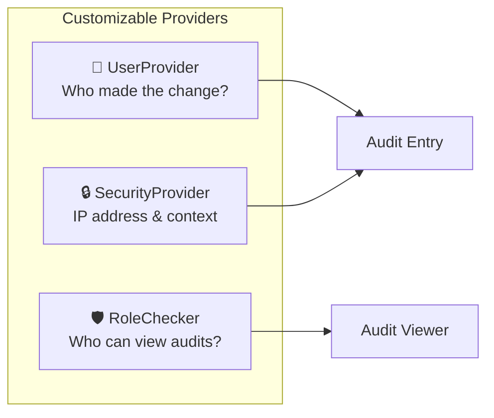

# Customization

> **Customize the bundle's providers for your specific needs**

This section covers how to customize the bundle's providers.

## 📋 Overview

The bundle uses three providers that can be customized:

| Provider          | Purpose                              | Default Service                  |
|-------------------|--------------------------------------|----------------------------------|
| User Provider     | Returns current user information     | `dh_auditor.user_provider`       |
| Security Provider | Returns IP address and firewall name | `dh_auditor.security_provider`   |
| Role Checker      | Checks if user can view entity audits | `dh_auditor.role_checker`       |         

## 📦 Built-in Providers

### UserProvider

The default `UserProvider`:

- ✅ Gets the current user from Symfony's `TokenStorage`
- ✅ Extracts user ID via `getId()` method (if exists)
- ✅ Extracts username via `getUserIdentifier()`
- ✅ Tracks impersonation (switch user)

### SecurityProvider

The default `SecurityProvider`:

- ✅ Gets client IP from the current `Request`
- ✅ Gets firewall name from `FirewallMap`

### RoleChecker

The default `RoleChecker`:

- ✅ Uses Symfony's `AuthorizationChecker`
- ✅ Checks roles configured per entity
- ✅ Grants access if no roles configured
- ✅ Grants access if no user authenticated

## 🖥️ Console Commands

The bundle automatically switches to `ConsoleUserProvider` during console commands:

- **User ID**: Command name (e.g., `app:import-users`)
- **Username**: Command name

This is handled by `ConsoleEventSubscriber` and requires no configuration.

> [!TIP]
> This allows you to filter audit entries by specific CLI command in the viewer.

## 🤔 When to Customize

### User Provider

- ❌ You don't use Symfony's security component
- 🔧 You need additional user information
- 🔐 You have a custom authentication system

### Security Provider

- 🌐 You're behind a proxy/load balancer
- 📡 You need custom headers for IP detection
- 📝 You want to capture additional context

### Role Checker

- 🔄 You need complex authorization logic
- 🔗 You integrate with an external authorization service
- 🎯 You need entity-specific or context-aware access control

---

## 📚 Customization Guides

- 👤 [User Provider](user-provider.md) - Custom user identification
- 🔒 [Security Provider](security-provider.md) - Custom IP/context detection
- 🛡️ [Role Checker](role-checker.md) - Custom access control
