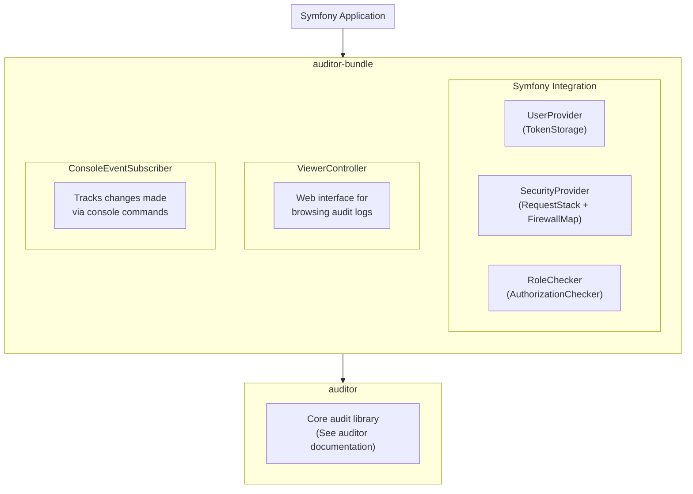

# auditor-bundle

> **Symfony integration for the auditor library**

---
id: intro
title: Introduction
slug: /intro
---

## What is auditor-bundle?

**auditor-bundle** integrates the [auditor](https://github.com/DamienHarper/auditor) library into Symfony applications. It provides automatic service configuration, a web interface for browsing audits, and seamless integration with Symfony's security system.

### ✨ Key Features

- 🔌 **Automatic wiring** - Services are automatically configured via Symfony's DI
- 🔒 **Security integration** - Uses Symfony's security for user tracking and access control
- 🌐 **Built-in viewer** - Web interface to browse audit logs at `/audit`
- 🖥️ **Console support** - Tracks changes made via console commands
- 🌍 **Internationalization** - Translations for 9 languages
- ⚙️ **YAML configuration** - Simple configuration via `dh_auditor.yaml`
- 📦 **Extra Data** - Attach custom contextual data to audit entries via event listeners

## 🏗️ Architecture Overview

The bundle bridges auditor with Symfony:

### 📦 What the Bundle Provides

| Component           | Service ID                     | Description                           |
|---------------------|--------------------------------|---------------------------------------|
| UserProvider        | `dh_auditor.user_provider`     | Gets current user from TokenStorage   |
| SecurityProvider    | `dh_auditor.security_provider` | Gets IP and firewall from Request     |
| RoleChecker         | `dh_auditor.role_checker`      | Checks access via Security component  |
| ConsoleUserProvider | (internal)                     | Tracks console command as user        |
| ViewerController    | (internal)                     | Web UI for audit logs                 |
| RoutingLoader       | (internal)                     | Loads viewer routes                   |

## 📋 Version Compatibility

| Version | Status                      | Requirements                                                         |
|:--------|:----------------------------|:---------------------------------------------------------------------|
| 7.x     | Active development 🚀       | PHP >= 8.4, Symfony >= 8.0, Doctrine DBAL >= 4.0, Doctrine ORM >= 3.2|
| 6.x     | Active support              | PHP >= 8.2, Symfony >= 5.4                                           |
| 5.x     | End of Life                 | PHP >= 7.4, Symfony >= 4.4                                           |

## 🚀 Quick Links

- 📥 [Installation Guide](getting-started/installation.md)
- ⚙️ [Configuration Reference](configuration/index.md)
- 🔧 [Customization](customization/index.md)
- 👁️ [Audit Viewer](viewer/index.md)
- ⬆️ [Upgrade Guides](upgrade/index.md)

## 🔗 Related Projects

- **[auditor](https://github.com/DamienHarper/auditor)** - The core audit library (required)

## 📜 License

This bundle is released under the [MIT License](https://opensource.org/licenses/MIT).
